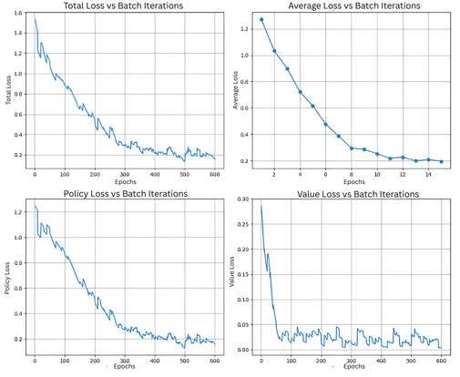
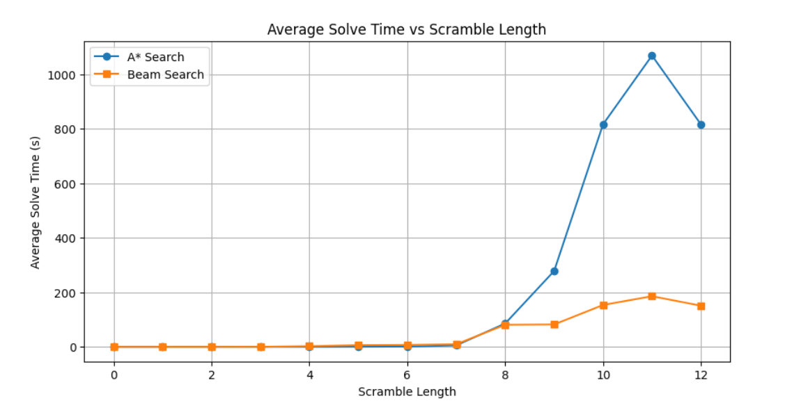
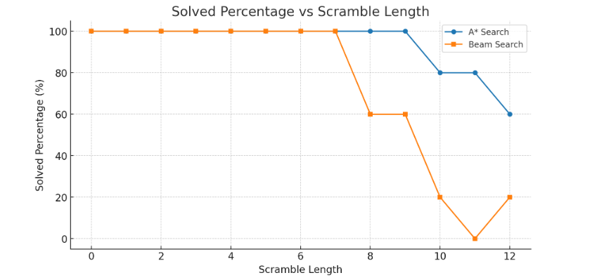
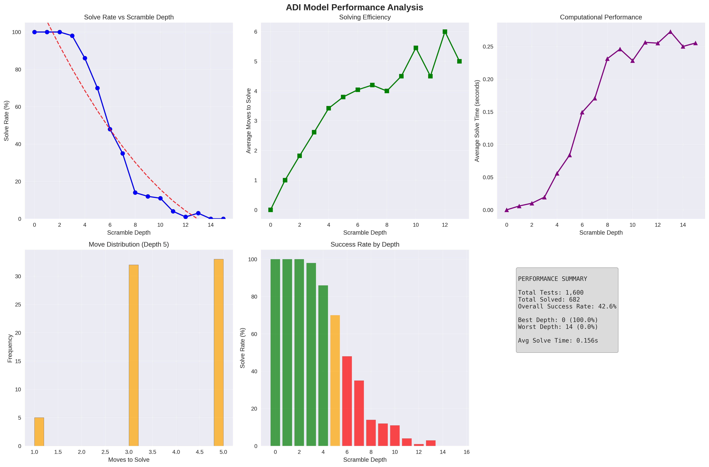

# RubikNet

RubikNet is a project exploring how AI and robotics can solve the Rubik’s Cube using **Reinforcement Learning**, **Deep Learning**, and **Search-based Solvers**.  

<p align="center">
  
</p>

This repository is organized into three main components:

---

## [Reinforcement Learning](https://github.com/Archaive16/RubikNet/tree/main/reinforcement_learning)
This folder contains our experiments with **RL agents** trained on classic control environments.  
We have implemented and solved the following environments:  

- **CartPole** – balancing a pole on a cart  
- **Taxi** – navigating a taxi to pick up and drop passengers  
- **MountainCar** – driving a car up a steep hill with limited power  
- **Blackjack** – learning strategies for the card game using Monte Carlo methods  

These experiments build the foundation for applying RL to more complex tasks like solving the Rubik’s Cube.  

---

## [Deep Learning](https://github.com/Archaive16/RubikNet/tree/main/deep_learning)
This folder is designed as a **introduction** on deep learning.  
- Covers the basics of **neural networks** and how they learn.  
- Hands-on projects on:  
  - **Digit Recognition (MNIST)**  
  - **Fashion Classification (Fashion-MNIST)**  
- Helps build the foundation needed before moving on to Reinforcement Learning and Cube Solvers.  


---

## [Cube Solver](https://github.com/Archaive16/RubikNet/tree/main/cube_solver)
This folder contains the **solver logic** for the Rubik’s Cube. 
1. Implemented **ADI(Autodidactic Iteration)** or Self Supervised Learning for cube solving.
<p align="center">
  
</p>
2. Includes ADI(Autodidactic Iteration) and classical search approaches.  
<p align="center">
  
</p>
<p align="center">
  
</p>
3. Can be used standalone to find solutions to scrambled states.  
<p align="center">
  
</p>

Check out the ReadMe of this folder to implement the whole solver.

---

## Usage
We recommend using [uv](https://docs.astral.sh/uv/) for environment management.  
To set up the project:  

```bash
# clone the repository
git clone https://github.com/Archaive16/RubikNet

# Install uv (if not already installed)
pip install uv

# Sync dependencies
uv sync
```

## Connect with us

#### Arhan Chavare  
[](https://github.com/Archaive16)
#### Rigvedi Borchate  
[](https://github.com/rigvedi-3301)  
 
# Achnowledgements
- [SRA VJTI](http://sra.vjti.info/),  Eklavya 2025
- Special thanks to our mentors, Ansh Semwal and Akash Kawle.

