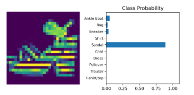

# Deep learning

This folder contains all the exercises that we did during the course

# Fashion-MNIST Dataset  

## Overview  
Fashion-MNIST is a dataset of **Zalando’s article images**, intended as a drop-in replacement for the classic MNIST dataset of handwritten digits. It is widely used for benchmarking machine learning algorithms in image classification.  

## Dataset Details  
- **Type**: Grayscale images  
- **Image size**: 28 × 28 pixels  
- **Number of classes**: 10 (fashion categories)  
- **Training set size**: 60,000 images  
- **Test set size**: 10,000 images  

## Classes  
Each image belongs to one of the following categories:  

0. T-shirt/top  
1. Trouser  
2. Pullover  
3. Dress  
4. Coat  
5. Sandal  
6. Shirt  
7. Sneaker  
8. Bag  
9. Ankle boot  

# Results

We got roughly around 90-95 percent accuracy while classifying fashion objects

  

