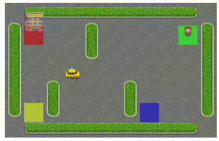
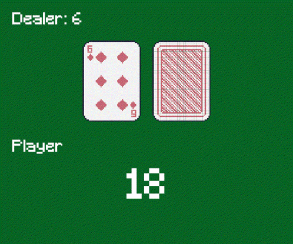
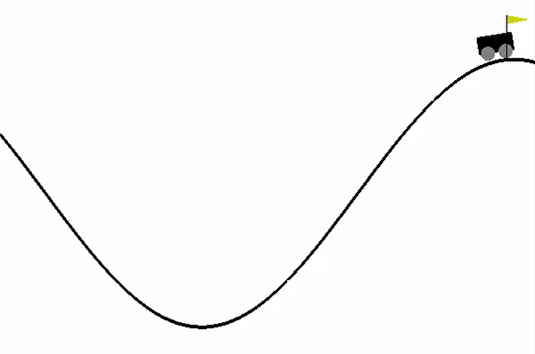

# Reinforcement Learning Implementations

This repository contains implementations of various reinforcement learning algorithms applied to different OpenAI Gymnasium environments. Each implementation demonstrates core RL concepts using different learning approaches.

## Files Overview

- **taxi.py** - Q-Learning implementation for the Taxi-v3 environment
- **blackjack.py** - Monte Carlo method for Blackjack-v1 environment  
- **mountain_car.py** - Q-Learning with state discretization for MountainCar-v0 environment
- **cartpole.py** - Q-Learning with state discretization for CartPole-v1 environment

## Environments and Implementations

### 1. Taxi Environment (taxi.py)

**Environment**: Taxi-v3

**Description**: A taxi must pick up a passenger at one location and drop them off at another location in a 5x5 grid world.

<p align="center">
  
</p>

**State Space**: 
- **Size**: 500 discrete states
- **Components**: 
  - Taxi position (25 positions in 5x5 grid)
  - Passenger location (4 locations + 1 in taxi = 5 states)  
  - Destination location (4 possible destinations)
  - Total: 25 × 5 × 4 = 500 states

**Action Space**:
- **Size**: 6 discrete actions
- **Actions**: 
  - 0: Move South
  - 1: Move North  
  - 2: Move East
  - 3: Move West
  - 4: Pickup passenger
  - 5: Dropoff passenger

**Algorithm**: Q-Learning with epsilon-greedy exploration
**Key Features**: 
- Bellman equation updates
- Epsilon decay over time
- Success tracking (reward = 20 for successful delivery)

---

### 2. Blackjack Environment (blackjack.py)

**Environment**: Blackjack-v1

**Description**: Classic card game where the goal is to get a hand value as close to 21 as possible without going over, while beating the dealer.

<p align="center">
  
</p>

**State Space**:
- **Size**: Variable (represented as tuple)
- **Components**:
  - Player's current sum (4-21)
  - Dealer's showing card (1-10) 
  - Player has usable ace (True/False)
  - Total: ~280 possible states

**Action Space**:
- **Size**: 2 discrete actions
- **Actions**:
  - 0: Stick (keep current hand)
  - 1: Hit (take another card)

**Algorithm**: Monte Carlo method with first-visit updates
**Key Features**:
- Episode generation and processing
- Discounted return calculation  
- Win rate evaluation (~42-43% expected)

---

### 3. Mountain Car Environment (mountain_car.py)

**Environment**: MountainCar-v0

**Description**: A car must reach a goal position on top of a hill by building momentum and oscillating back and forth. The car starts in a valley and must use gravity to gain enough momentum to reach the flag at the top.

<p align="center">
  
</p>

**State Space**:
- **Size**: 2 continuous variables (discretized to ~1000 bins)
- **Components**:
  - Car position (-1.2 to 0.6) - discretized to 19 bins
  - Car velocity (-0.07 to 0.07) - discretized to 14 bins
  - Total discretized states: 19 × 14 = 266 states

**Action Space**:
- **Size**: 3 discrete actions
- **Actions**:
  - 0: Push left (accelerate left)
  - 1: No push (coast)
  - 2: Push right (accelerate right)

**Algorithm**: Q-Learning with state space discretization
**Key Features**:
- Continuous state space discretized into bins
- Random Q-table initialization (between -1 and 1)
- Success tracking (car position >= 0.5)
- Visual rendering during evaluation

---

### 4. CartPole Environment (cartpole.py)

**Environment**: CartPole-v1

**Description**: Balance a pole on a cart by applying forces to move the cart left or right. The episode ends when the pole falls over or the cart moves too far from center.

<p align="center">
  
</p>

**State Space**:
- **Size**: 4 continuous variables (discretized to 10^4 = 10,000 states)
- **Components**:
  - Cart position (-4.8 to 4.8)
  - Cart velocity (-∞ to ∞, clipped to ±3.0)
  - Pole angle (-0.418 to 0.418 radians ≈ ±24°)
  - Pole angular velocity (-∞ to ∞, clipped to ±50°/sec)

**Action Space**:
- **Size**: 2 discrete actions  
- **Actions**:
  - 0: Push cart to the left
  - 1: Push cart to the right

**Algorithm**: Q-Learning with state space discretization
**Key Features**:
- Continuous state space discretized into 10x10x10x10 bins
- Custom reward function for better learning
- Epsilon-greedy exploration with decay
- Visual rendering for testing

## Key Reinforcement Learning Concepts

### Q-Learning (taxi.py, mountain_car.py, cartpole.py)
- **Temporal Difference Learning**: Updates Q-values after each step
- **Bellman Equation**: Q(s,a) ← Q(s,a) + α[r + γ·max(Q(s',a')) - Q(s,a)]
- **Off-policy**: Learns optimal policy while following epsilon-greedy policy

### Monte Carlo Methods (blackjack.py)  
- **Episode-based Learning**: Updates Q-values after complete episodes
- **Return Calculation**: Uses discounted cumulative rewards
- **On-policy**: Updates policy being followed

### State Discretization (mountain_car.py, cartpole.py)
- **Continuous to Discrete**: Converting infinite state spaces to finite bins
- **Binning Strategy**: Different resolutions for different state dimensions
- **Trade-offs**: Fewer bins = faster learning but less precision

### Common Elements
- **Epsilon-greedy Exploration**: Balance between exploitation and exploration
- **Epsilon Decay**: Reduce exploration over time as agent learns
- **Discount Factor (γ)**: Weight future rewards (typically 0.9-0.999)
- **Learning Rate (α)**: Step size for Q-value updates

## Running the Code

Each file can be run independently:

```bash
pip install uv # if not installled previously
uv sync  # install required packages
# for running a file
uv run [filename].py
```


## Environment Difficulty Comparison

1. **Easiest**: Taxi - Discrete states, clear reward structure
2. **Medium**: Blackjack - Discrete states but probabilistic outcomes  
3. **Hard**: CartPole - Continuous states requiring discretization, balance task
4. **Hardest**: Mountain Car - Sparse rewards, requires momentum building strategy

## Key Resources For Learning RL

- RL Course by David Silver [https://youtube.com/playlist?list=PLzuuYNsE1EZAXYR4FJ75jcJseBmo4KQ9-&si=xTWDZ51ij9WXcF_n]
- Reinforcement Learning [https://youtu.be/to-lHJfK4pw?si=8LtSDwL_wdS_85Wv]
- Introduction to Deep Reinforcement Learning (Deep RL) [https://youtu.be/zR11FLZ-O9M?si=rfe19d4MZ0HUbmxL]
- DeepMind x UCL | Reinforcement Learning Course 2018 [https://youtube.com/playlist?list=PLqYmG7hTraZBKeNJ-JE_eyJHZ7XgBoAyb&si=Zb2GjkAXr8n7wfNL]

